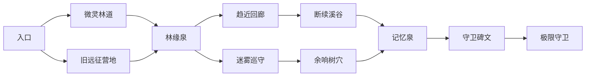

# 极限森林 forest_v0_2 实施与规则

新远征使用 forest_v0_2；calculus_v0_1 仍保持原五节点行为与状态哈希。知识卡在开局冻结，当前 C0 仍由模拟伴学快照投影供给（real_learning_data=false），远征不会发放、恢复、销毁知识卡或写入学习事实。

## 路线



11 个地点、三个区域、两次分支。节点描述、可达边、地点情报及坐标由 Python forest.py 单一内容源发布；客户端只展示投影和提交动作 ID。地图坐标对齐森林场景地标。

## 首版可调规则

- 旧远征营地：研读日志消耗 2 生命，立即永久保存远征日志并获得本轮守卫情报；或回收 2 材料。
- 林缘泉：恢复 6 生命，或取得 2 材料。
- 趋近回廊：固定终点锚点停止无限折半，获得 3 材料；或损失 5 生命强行穿越，获得 5 材料。
- 断续溪谷：损失 2 生命搜寻 4 材料；或安全通过。
- 余响树穴：损失 3 生命取得苔光护符，本轮后续每场战斗的伤害倍率增加 10 个百分点；或安全通过。
- 记忆泉：恢复 8 生命；或下一场战斗伤害提高 25%。
- 守卫碑文：损失 3 生命获取本轮守卫情报；或取得 2 材料。
- 微灵林道：敌方生命 10、攻击 3。迷雾巡守：生命 16、攻击 4。普通战斗获 3 材料及原有临时奖励三选一。
- 守卫：生命 30、攻击 6；有情报时生命 22、攻击 4。战胜后获得 8 材料及守望徽记，确认结束远征后结算。
- 主动撤退保留本轮所有已获得材料和遗物；失败保留材料的一半（向下取整），丢弃本轮遗物；永久线索在发现时入营，不受失败影响。
- 所有终局的结算仅发生一次。已入营资源不损失。终局可花费 6 材料永久修复灰铃哨塔。遗物收藏跨远征保存；本轮苔光护符效果不自动带入新轮。
- 暂时查看营地与退出窗口均不提交撤退。run_id 持续指向同一局，重新读回保存状态即可恢复。

## 契约与可靠性

bootstrap 增列 forest_v0_2，用场景是否存在门控。旧场景不包含 expedition；新场景 run.expedition 包含内容、节点、战利品、事件、结算和最新营地。action-ID-only 请求不变，增加 choose_event:<id> 和 repair_camp，沿用 abandon_run 支持探索/事件/战斗/奖励中撤退。

SQLite schema 从 1 迁移到 2，旧 run JSON 和哈希不改写；新增 dungeon_camps，每 owner 一行，带版本与完整性哈希。每个新远征动作读营地版本；营地 CAS、run CAS 和命令回执在同一个 BEGIN IMMEDIATE 事务提交。并发跨 run 的修复/结算在版本冲突时拒绝，不丢更新。事务失败同时回滚 run、营地和回执；重复命令重放原引擎响应，不重复结算。公开 read/action 响应的营地覆盖为最新 owner 营地，run state_hash 仍对应持久化的本轮状态（包括当时营地快照），不会为了读回营地而改写本轮版本。

公开 schema 以 knowledge_dungeon/schemas/public_run_v1.json 为准。新增事件为 event_entered（node_id）、event_resolved（node_id、choice_id）、expedition_settled（outcome、materials_kept、materials_lost）、camp_repaired（repair_id）。新增 phase=event；只有此阶段 event 对象非空。击败 Boss 后是 boss_defeated/map，仍须提交 finish_run 才会变为 completed/complete 并入营结算。失败为 failed/failed，撤退为 abandoned/complete。

内存 restore_state 同时恢复快照内的 owner 营地，按 camp_version 保留最新版本；后加载旧 run 快照不会回滚新营地。正式生产恢复仍从 SQLite 读取。

公共投影不含 owner、随机种子或私有 CAS 版本。存储营地损坏时拒绝推进，不重置资源。

## 运行与交付

在此插件 worktree 运行真实服务：

```powershell
uv run --directory E:/Work/CODE/worktrees/study-forest-expedition python -m knowledge_dungeon.forest_dev_server --database E:/Work/CODE/.codex-tmp/forest-dev/save.sqlite3 --runtime-dir E:/Work/CODE/.codex-tmp/forest-dev/runtime
```

Electron 使用相同 runtime 目录配对。本开发入口复用正式私有桥接、鉴权、SQLite 和状态机。Ctrl+C 统一停止监听和服务线程。没有 TypeScript 战斗/掉落模拟引擎。

代表性快照复现：

```powershell
uv run python -m knowledge_dungeon.forest_fixture_exporter --output tests/fixtures/knowledge_dungeon/forest_snapshots.json
```

快照用于跨仓库协议验收，并非可自由探索的预录模拟图。

## 验证范围

服务测试覆盖两条完整路线、Boss 情报差异、事件选择、四阶段撤退、失败分配、永久线索、跨局营地、事件中重启恢复、重复结束、跨 run 双引擎修复竞争、并发结算重试求和、内存快照新旧顺序恢复和事务故障注入。客户端 Electron 画面、动画资源生命周期与帧率由客户端工作区验收。
